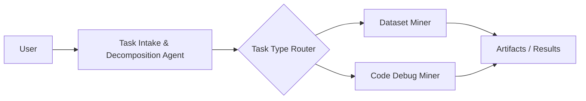
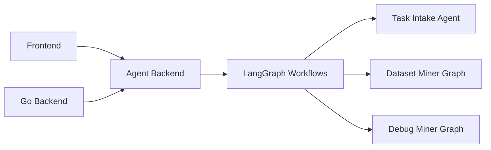
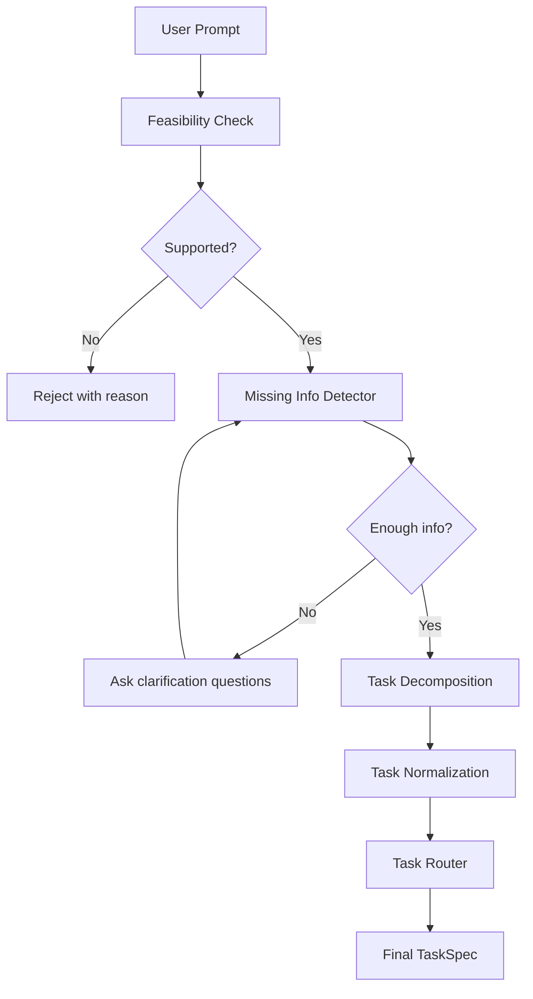
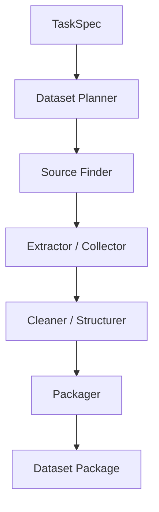
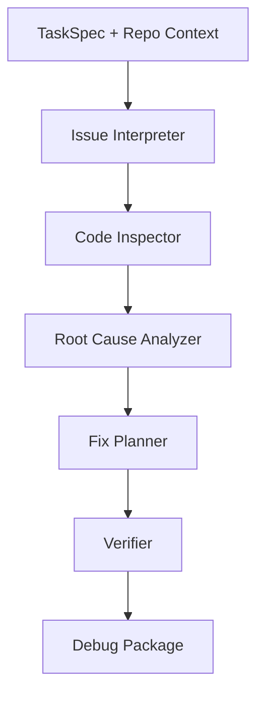

# Agent Architecture Plan

## 1. Goal

This document defines the MVP agent architecture for the project.

Current goal:

- build a practical demo-first agent system
- keep the architecture extensible for later hackathon iterations
- focus on task decomposition first
- support two execution miners:
  - Dataset Miner
  - Code Debug Miner

This version does not include scoring or AI audit logic. Those can be added later.

---

## 2. Core Design Idea

The agent system should not start as a fully autonomous multi-agent swarm.

For the MVP, we use:

- one entry agent for task intake and decomposition
- one router layer
- two specialized execution miners

This gives us a clean and demo-friendly architecture:



Why this is the right structure:

- easier to explain to judges and teammates
- more stable than a swarm architecture
- lower implementation risk
- easy to upgrade into LangGraph graphs later

---

## 3. System Roles

### 3.1 Task Intake & Decomposition Agent

Responsibilities:

- receive a complete user task description
- check whether the task is within supported scope
- detect missing information
- ask clarification questions if needed
- normalize the task into a unified `TaskSpec`
- route the task to the correct miner

This is the most important agent in the whole system.

It is not an execution agent.
It is the intake, validation, and routing layer.

### 3.2 Dataset Miner

Responsibilities:

- read a normalized dataset task
- plan data sources
- collect raw content from allowed sources
- clean and structure the data
- export a usable dataset package

This miner should be framed as a dataset production workflow, not just a crawler.

### 3.3 Code Debug Miner

Responsibilities:

- read a normalized debug task
- inspect repo context and relevant files
- analyze likely root cause
- produce a fix plan
- optionally generate a patch and verification plan

This miner should be framed as a repo-aware debugging workflow, not just a chatbot.

---

## 4. Recommended Technical Direction

For a mainstream and extensible enterprise-style stack, the most suitable choice is:

- `LangGraph` for orchestration and stateful workflow
- `LangChain` for model/tool integration where useful
- a separate `Agent Backend` service
- existing `Go backend` continues to own chain operations and business execution

Recommended service split:



Suggested boundary:

- `Go backend`
  - chain interaction
  - task lifecycle
  - wallet / settlement / on-chain calls
- `Agent backend`
  - task intake
  - decomposition
  - routing
  - miner execution workflows
  - structured artifacts and traces

---

## 5. MVP Scope

### Must Have

- Task Intake & Decomposition Agent
- Dataset Miner
- Code Debug Miner
- unified `TaskSpec`
- visible execution trace
- artifact output for each miner

### Not In Scope For This Version

- AI scoring
- validator audit logic
- miner reputation system
- fully autonomous multi-agent swarm
- complex long-running distributed task scheduling

---

## 6. Unified TaskSpec

All downstream miners should consume the same normalized task object.

```json
{
  "task_info": {
    "task_id": "task_001",
    "title": "Web3 vulnerability dataset generation",
    "task_type": "dataset_generation"
  },
  "feasibility": {
    "accepted": true,
    "reason": "Task is within supported scope"
  },
  "user_requirements": {
    "goal": "Generate a training-ready Web3 vulnerability dataset",
    "detailed_requirements": [
      "Cover reentrancy, access control, and price manipulation"
    ],
    "constraints": [
      "Public sources only",
      "Output JSONL"
    ],
    "output_format": "jsonl"
  },
  "execution_context": {
    "target_schema": ["title", "content", "label", "source", "evidence"],
    "target_size": 100,
    "source_scope": ["docs", "blogs", "github"]
  },
  "routing": {
    "assigned_agent": "dataset_miner"
  }
}
```

Why this matters:

- frontend can render it clearly
- backend can store it cleanly
- miners can share one protocol
- future on-chain integration becomes easier

---

## 7. Task Intake & Decomposition Agent

### Product Role

This agent is the task gateway of the whole platform.

It should do four things:

1. determine whether the task can be accepted
2. detect missing information
3. convert natural language into structured task data
4. route the task to the right miner

### Flow



### Input

- `user_prompt`
- optional context
- optional session memory

### Output Mode A: Accepted

Returns final `TaskSpec`.

### Output Mode B: Needs More Info

```json
{
  "feasibility": {
    "accepted": false,
    "reason": "Missing required information"
  },
  "missing_fields": [
    "target_size",
    "output_format",
    "source_scope"
  ],
  "next_question": "Please provide source scope, output format, and target size."
}
```

### Why this agent is highly feasible

- strong fit for LLM structured output
- low dependency on external systems
- ideal for LangGraph state-based design
- highest leverage for downstream miner success

---

## 8. Dataset Miner

### Product Role

Dataset Miner should be presented as a dataset production workflow.

It is not only a crawler.

Its real value is:

- planning sources
- collecting raw material
- cleaning and structuring data
- exporting a reusable dataset package

### Flow



### Node Responsibilities

- `Dataset Planner`
  - understand topic, schema, size, source limits
- `Source Finder`
  - produce a candidate source list
- `Extractor / Collector`
  - fetch raw content from selected sources
- `Cleaner / Structurer`
  - deduplicate, normalize fields, enforce schema
- `Packager`
  - generate final dataset files and report

### Input

- `TaskSpec`

### Output

```json
{
  "task_id": "task_001",
  "status": "completed",
  "summary": {
    "records": 120,
    "sources_used": 5,
    "duplicates_removed": 18
  },
  "artifacts": [
    {"type": "dataset", "path": "dataset.jsonl"},
    {"type": "sources", "path": "sources.json"},
    {"type": "report", "path": "report.md"},
    {"type": "trace", "path": "trace.json"}
  ]
}
```

### Feasibility Notes

Feasible for MVP if we constrain it to:

- public sources
- limited domains or source types
- text-oriented extraction
- structured export such as `jsonl`

Not realistic for MVP if we promise:

- arbitrary web-scale crawling
- private or login-gated data
- high-quality human-level labeling
- deep domain factual verification

---

## 9. Code Debug Miner

### Product Role

Code Debug Miner should be presented as a repo-aware debugging workflow.

It is not just a coding chatbot.

Its value is:

- understanding the issue
- collecting code context
- narrowing down likely causes
- generating a fix plan
- optionally generating a patch and verification steps

### Flow



### Node Responsibilities

- `Issue Interpreter`
  - normalize the bug description
- `Code Inspector`
  - locate files, modules, call paths, and logs
- `Root Cause Analyzer`
  - identify likely causes and suspicious files
- `Fix Planner`
  - propose changes or create patch candidates
- `Verifier`
  - define validation steps and regression checks

### Input

- `TaskSpec`
- `repo_path`
- `bug_description`
- optional logs

### Output

```json
{
  "task_id": "task_002",
  "status": "completed",
  "root_cause": [
    "Task creation succeeds but frontend task state is not refreshed"
  ],
  "artifacts": [
    {"type": "report", "path": "debug_report.md"},
    {"type": "patch", "path": "patch.diff"},
    {"type": "verification", "path": "verification_steps.md"},
    {"type": "trace", "path": "trace.json"}
  ]
}
```

### Feasibility Notes

Feasible for MVP if we constrain it to:

- small to medium repo context
- explicit bug description
- reproducible or inspectable problem
- patch planning and simple code fixes

Not realistic for MVP if we promise:

- fully autonomous large-scale refactors
- deep infra debugging across many services
- opaque production-only failures
- guaranteed successful end-to-end fixes

---

## 10. Why We Do Not Start With an Agent Swarm

For this hackathon stage, a swarm is unnecessary and risky.

Reasons:

- harder to explain
- harder to debug
- more failure points
- higher implementation cost
- weak payoff compared with a structured graph workflow

Better path:

1. start with one intake agent and two specialized miners
2. make each miner internally multi-step
3. only later split miners into more granular sub-agents if needed

---

## 11. Suggested LangGraph Modeling

### Graph A: Task Intake Agent

Nodes:

- feasibility_check
- missing_info_detector
- clarification_loop
- decompose_task
- normalize_task
- route_task

### Graph B: Dataset Miner

Nodes:

- dataset_planner
- source_finder
- extractor
- cleaner
- packager

### Graph C: Code Debug Miner

Nodes:

- issue_interpreter
- code_inspector
- root_cause_analyzer
- fix_planner
- verifier

This gives us enterprise-style workflow graphs while keeping the MVP manageable.

---

## 12. UI / Demo Presentation Strategy

For the demo, each agent should expose:

- current stage
- current status
- trace steps
- final artifacts

Recommended UI concepts:

- intake summary card
- routed miner badge
- execution trace timeline
- downloadable artifacts panel

This makes the system feel practical and inspectable rather than magical.

---

## 13. Final Recommendation

For the current project stage, the best overall design is:

- one `Task Intake & Decomposition Agent`
- one `Dataset Miner`
- one `Code Debug Miner`
- one unified `TaskSpec`
- one separate `Agent Backend`
- `LangGraph` as the workflow foundation

This design is:

- practical
- easy to demo
- realistic to implement
- extensible for future scoring, audit, and more miners

The most important first step is not building many agents.
The most important first step is building a strong intake agent and a clean task protocol.
