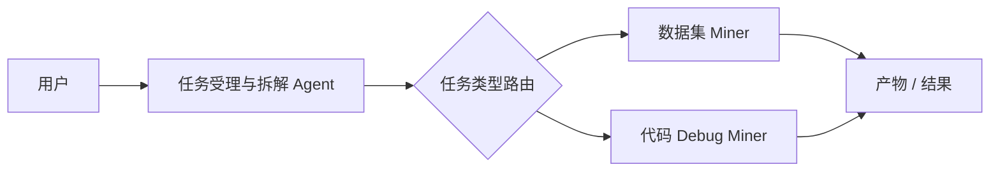
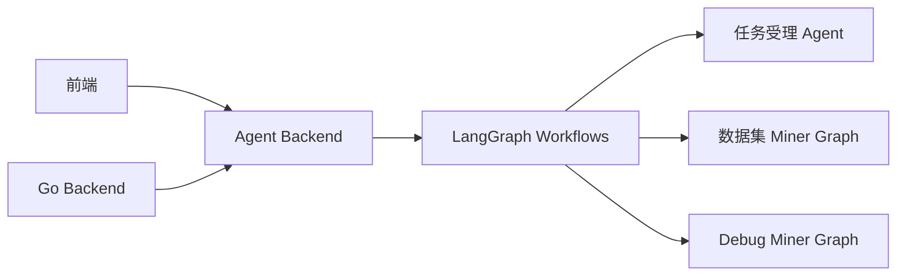
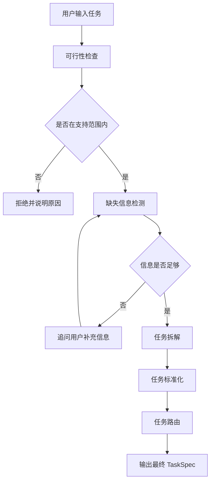
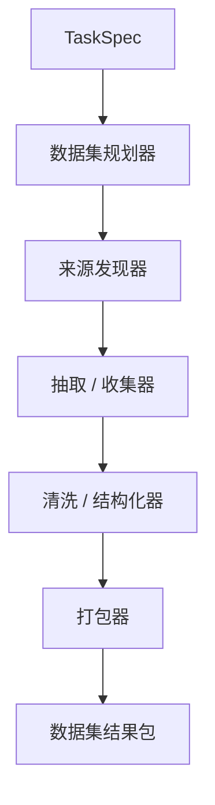
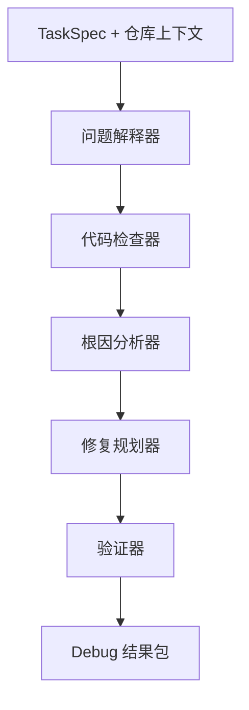

# Agent 整体架构设计方案

## 1. 方案目标

这份文档用于定义当前项目的 MVP 版 Agent 架构方案，方便团队内部对齐。

当前目标：

- 先做一个实用、可演示、可扩展的 Agent 系统
- 以任务拆解为核心入口
- 支持两个执行型 Miner：
  - 数据集 Miner
  - 代码 Debug Miner
- 暂时不做打分、审计、声誉等后续模块

这版的重点不是做一个复杂的 Agent 集群，而是先把任务入口、任务协议、执行流程搭稳。

---

## 2. 核心设计思路

当前阶段不建议一开始就做“多 Agent 自治集群”。

MVP 最合适的结构是：

- 一个入口 Agent，负责任务受理和拆解
- 一个路由层
- 两个专用执行 Miner

整体结构如下：



这样设计的原因：

- 容易讲清楚，适合 hackathon demo
- 比 swarm 架构稳定很多
- 实现成本更低
- 后续很容易升级成 LangGraph 的多节点工作流

---

## 3. 系统角色划分

### 3.1 任务受理与拆解 Agent

职责：

- 接收用户的完整任务描述
- 判断当前任务是否在支持范围内
- 检测关键信息是否缺失
- 在必要时追问用户补充信息
- 将自然语言任务标准化为统一的 `TaskSpec`
- 将任务路由给正确的 Miner

这是整个系统里最重要的 Agent。

它不是执行 Agent，而是整个系统的任务入口、任务校验层和分发层。

### 3.2 数据集 Miner

职责：

- 接收标准化后的数据集任务
- 规划数据源
- 收集原始内容
- 清洗和结构化数据
- 导出可使用的数据集产物

这个 Miner 不应该被定义成“只是一个爬虫”，而应该定义成一个完整的数据集生产工作流。

### 3.3 代码 Debug Miner

职责：

- 接收标准化后的代码调试任务
- 读取仓库上下文和相关文件
- 分析可能的根因
- 输出修复方案
- 在可能的情况下输出 patch 和验证方案

这个 Miner 不应该被定义成“普通聊天助手”，而应该定义成一个面向代码仓库的调试工作流。

---

## 4. 推荐技术方向

如果希望使用主流、企业级、后续可扩展的 Agent 技术方案，推荐方向如下：

- 使用 `LangGraph` 作为整体工作流编排框架
- 使用 `LangChain` 作为模型调用和工具接入层
- 单独部署一个 `Agent Backend`
- 保留现有 `Go backend` 继续负责链上和业务核心逻辑

推荐服务结构如下：



建议边界：

- `Go backend`
  - 负责链上交互
  - 负责任务状态生命周期
  - 负责钱包、结算、合约调用
- `Agent backend`
  - 负责任务受理
  - 负责任务拆解
  - 负责路由
  - 负责 Miner 执行工作流
  - 负责结构化产物和 trace

---

## 5. 当前版本的 MVP 范围

### 必须做的

- 任务受理与拆解 Agent
- 数据集 Miner
- 代码 Debug Miner
- 统一的 `TaskSpec`
- 可视化执行 trace
- 每个 Miner 都有产物输出

### 当前不做的

- AI 打分
- Validator 审计逻辑
- Miner 声誉系统
- 完全自治的多 Agent swarm
- 复杂的分布式长任务调度系统

---

## 6. 统一任务协议：TaskSpec

后续所有 Miner 都应该消费同一个标准化任务对象。

示例：

```json
{
  "task_info": {
    "task_id": "task_001",
    "title": "Web3 漏洞数据集生成",
    "task_type": "dataset_generation"
  },
  "feasibility": {
    "accepted": true,
    "reason": "任务在当前支持范围内"
  },
  "user_requirements": {
    "goal": "生成一个可用于训练的 Web3 漏洞数据集",
    "detailed_requirements": [
      "覆盖重入、权限控制、价格操纵"
    ],
    "constraints": [
      "仅公开来源",
      "输出 JSONL"
    ],
    "output_format": "jsonl"
  },
  "execution_context": {
    "target_schema": ["title", "content", "label", "source", "evidence"],
    "target_size": 100,
    "source_scope": ["docs", "blogs", "github"]
  },
  "routing": {
    "assigned_agent": "dataset_miner"
  }
}
```

这个统一协议的重要性：

- 前端容易展示
- 后端容易存储
- 不同 Miner 可以共享一套输入标准
- 未来接链上或任务市场更容易

---

## 7. 任务受理与拆解 Agent

### 产品定位

这个 Agent 是整个系统的任务网关。

它需要完成 4 件事：

1. 判断任务能不能接
2. 判断用户信息是否完整
3. 将自然语言任务转成结构化任务数据
4. 把任务分发给正确的 Miner

### 流程图



### 输入

- `user_prompt`
- 可选上下文
- 可选会话记忆

### 输出模式 A：可以受理

直接输出最终 `TaskSpec`

### 输出模式 B：信息不足，需要补充

```json
{
  "feasibility": {
    "accepted": false,
    "reason": "缺少必要信息"
  },
  "missing_fields": [
    "target_size",
    "output_format",
    "source_scope"
  ],
  "next_question": "请补充你希望的数据来源范围、输出格式和目标数量"
}
```

### 为什么这个 Agent 最适合优先做

- 很适合 LLM 做结构化输出
- 几乎不依赖复杂外部系统
- 非常适合 LangGraph 的状态机模式
- 对后续 Miner 成功率影响最大

---

## 8. 数据集 Miner

### 产品定位

数据集 Miner 应该被定义成“数据集生产工作流”。

它不是简单的爬虫，而是负责：

- 规划数据源
- 收集原始材料
- 清洗并标准化
- 导出可复用的数据集包

### 流程图



### 各节点职责

- `数据集规划器`
  - 读取主题、字段、目标规模、来源限制
- `来源发现器`
  - 生成候选来源列表
- `抽取 / 收集器`
  - 从选定来源获取原始内容
- `清洗 / 结构化器`
  - 去重、字段抽取、格式标准化、schema 统一
- `打包器`
  - 生成最终数据集文件和报告

### 输入

- `TaskSpec`

### 输出

```json
{
  "task_id": "task_001",
  "status": "completed",
  "summary": {
    "records": 120,
    "sources_used": 5,
    "duplicates_removed": 18
  },
  "artifacts": [
    {"type": "dataset", "path": "dataset.jsonl"},
    {"type": "sources", "path": "sources.json"},
    {"type": "report", "path": "report.md"},
    {"type": "trace", "path": "trace.json"}
  ]
}
```

### 可行性边界

MVP 可行的前提：

- 只处理公开来源
- 只处理有限来源或有限域名
- 以文本数据抽取为主
- 输出结构化格式，例如 `jsonl`

MVP 不适合承诺的内容：

- 任意全网大规模自动抓取
- 私有或登录后数据
- 高强度人工标注级别的数据质量
- 深度事实核验型任务

---

## 9. 代码 Debug Miner

### 产品定位

代码 Debug Miner 应该被定义成“面向代码仓库的调试工作流”。

它的价值在于：

- 理解问题
- 收集代码上下文
- 缩小问题范围
- 输出修复方案
- 在可能时输出 patch 和验证步骤

### 流程图



### 各节点职责

- `问题解释器`
  - 标准化 bug 描述
- `代码检查器`
  - 找文件、找模块、找调用链、找日志
- `根因分析器`
  - 分析可能根因、锁定可疑文件
- `修复规划器`
  - 生成修复方案或 patch 候选
- `验证器`
  - 生成验证步骤和回归检查建议

### 输入

- `TaskSpec`
- `repo_path`
- `bug_description`
- 可选日志

### 输出

```json
{
  "task_id": "task_002",
  "status": "completed",
  "root_cause": [
    "任务创建成功后前端 tasks state 未刷新"
  ],
  "artifacts": [
    {"type": "report", "path": "debug_report.md"},
    {"type": "patch", "path": "patch.diff"},
    {"type": "verification", "path": "verification_steps.md"},
    {"type": "trace", "path": "trace.json"}
  ]
}
```

### 可行性边界

MVP 可行的前提：

- 仓库规模中小型
- 有明确的问题描述
- 问题可复现或至少可分析
- 重点做修复方案和小范围 patch

MVP 不适合承诺的内容：

- 超大规模系统级重构
- 多服务复杂基础设施问题
- 只有线上环境才能复现的黑盒问题
- 保证一定修好所有问题

---

## 10. 为什么当前不建议先做 Agent Swarm

对于当前 hackathon 阶段，swarm 架构不是最优选择。

原因：

- 更难讲清楚
- 更难调试
- 失败点更多
- 实现成本更高
- 相比结构化 graph 工作流，收益不明显

更合理的路线：

1. 先做一个入口 Agent 和两个专用 Miner
2. 每个 Miner 内部做成多步骤工作流
3. 以后如果需要，再把 Miner 内部拆成更细粒度的子 Agent

---

## 11. LangGraph 建模建议

### 图 A：任务受理与拆解 Agent

节点建议：

- feasibility_check
- missing_info_detector
- clarification_loop
- decompose_task
- normalize_task
- route_task

### 图 B：数据集 Miner

节点建议：

- dataset_planner
- source_finder
- extractor
- cleaner
- packager

### 图 C：代码 Debug Miner

节点建议：

- issue_interpreter
- code_inspector
- root_cause_analyzer
- fix_planner
- verifier

这样既符合企业级工作流的设计方式，也能把 MVP 控制在合理复杂度内。

---

## 12. Demo 展示建议

为了让 Demo 更像一个真实系统，而不是只会聊天的 bot，每个 Agent 都应该展示：

- 当前阶段
- 当前状态
- 执行 trace
- 最终产物

推荐前端表现形式：

- 任务受理摘要卡片
- 路由到哪个 Miner 的标识
- 执行过程时间线
- 可下载的产物面板

这样可以让系统更有“可执行、可检查、可交付”的感觉。

---

## 13. 最终建议

对于当前项目阶段，最适合的整体方案是：

- 一个 `任务受理与拆解 Agent`
- 一个 `数据集 Miner`
- 一个 `代码 Debug Miner`
- 一套统一的 `TaskSpec`
- 一个单独部署的 `Agent Backend`
- 使用 `LangGraph` 作为工作流底座

这个方案的优点：

- 实用
- 适合 demo
- 真实可落地
- 后续容易扩展到打分、审计、更多 Miner

当前最重要的第一步，不是做很多 Agent。
而是先把任务入口和统一任务协议做好。
