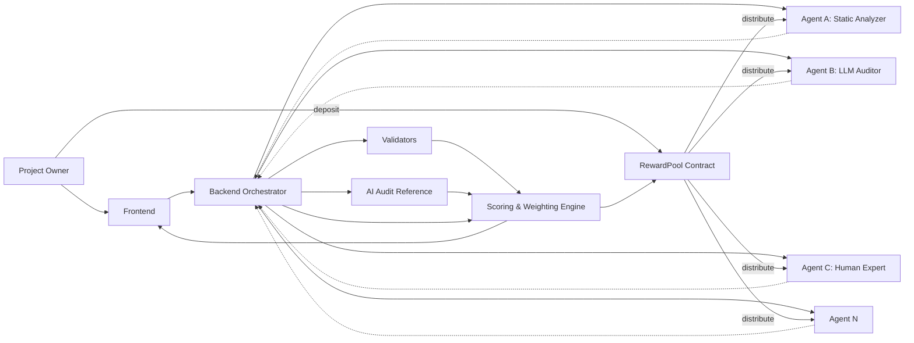

# Project Codename: TBD

## 候选项目名
- ProofArena
- TaskMesh
- AuditArena
- AgentJudge
- ComputeBounty

**最终项目名: TBD**

> 一个面向通用计算任务的去中心化 Agent 计算与评估协议，链下执行、链上完成奖励托管与结算；

黑客松目标: Demo 以智能合约审计作为首个垂直场景, 把 **Web3 安全审计"贵、慢、不可信"** 这个行业级痛点,做成一个 **去中心化、多 Agent 协同评估、人工兜底、链上结算** 的开放市场。Demo 用 smart contract audit 作为第一个落地 vertical, 但底层是 **general computation task protocol**。

---

## 1. 痛点 (Why this matters)

> 这一节是整个文档的核心 — 痛点越大、越被大家熟知, 解决方案就越有价值。

### 1.1 行业级痛点: Web3 安全审计供不应求

这是目前整个加密行业最被广泛认知、最常被引用、损失最惨重的痛点之一:

- **黑客攻击 / Rug Pull 频发, 损失巨大**  
  公开行业经验与多家安全机构 (如 SlowMist, CertiK, PeckShield, Chainalysis 等历史报告) 长期显示: Web3 行业每年因合约漏洞、桥漏洞、私钥泄露、钓鱼等事件造成的损失, 累计已达 **数百亿美元** 量级. 单一年度的损失也常以 **数十亿美元** 计.  
  (注: 出于严谨, 我们不在文档中给出未经验证的精确数字, 仅以 "billions of dollars lost historically" 描述, 实际 pitch 时可引用你确认过的具体报告.)

- **审计供给严重不足**  
  顶级安全公司档期通常排到几个月之后, 中小项目方根本排不上. 一个完整审计报价动辄 **几万到几十万美元**, 而且交付周期长, 反馈循环慢.

- **审计质量本身不可信**  
  即使做了审计, 项目方也无法保证: 审计员是否真的仔细看? 是否漏掉关键漏洞? 不同审计公司标准不一, 业内还有 "audit theater" (走形式审计) 的批评. 历史上多个被审计过的合约, 上线后仍然被攻击, 这种案例在 DeFi 历史上不胜枚举.

- **单一审计师/单一模型天然有偏见和盲点**  
  不论是人力审计师, 还是单一 AI 模型 (例如某 LLM 跑一遍代码), 都存在认知偏差、知识盲区和攻击模式库不全的问题. 没有一个"对手方机制" 互相校验.

- **赏金 / Bug Bounty 平台也只是事后兜底**  
  Immunefi 等平台已经在做 bug bounty, 但大多都是 **事后** 模式: 漏洞被利用 / 被白帽发现之后, 才触发奖励. 无法做到 **主动、持续、多方协同** 的审计.

### 1.2 由此衍生的"客户的真实损失"

如果客户 (Web3 项目方、DAO、基金会) 不解决这个问题, 会持续面临:

- **资金损失风险**: 一旦上线后被攻击, 损失动辄百万 / 千万美元级, 项目直接归零.
- **信任流失**: 用户和投资人看到 "未审计" 或 "审计仍被攻击" 的标签, 直接撤资撤户.
- **上线延期**: 排队等审计公司档期, 错过市场窗口.
- **审计预算失控**: 反复修复合规问题, 改一次就要重新审计, 成本成倍增加.

### 1.3 我们的判断: 痛点的本质是"评估机制 + 激励机制的缺失"

- **贵**: 因为没有开放的供给侧市场, 价格被少数审计公司垄断.
- **慢**: 因为评估是单点、串行、人力密集.
- **不可信**: 因为没有多方校验 + 透明激励.

> 核心论点: **审计不是"少一个审计师"的问题, 是"评估 + 激励"基础设施的问题**.  
> 而多 Agent + AI Audit + 人工兜底 + 链上结算, 正好可以补足这一层基础设施.

---
## 2. 解决方案: （项目名TBD的） 是什么

**（项目名TBD的） = 一个去中心化的"任务评估 + 奖励分配"协议, 专门解决 Web3 安全 (以及未来其他 general computation) 任务中的可信评估与公平激励问题.**

- **底层 (General)**: 我们做的是一个 general computation task protocol — 任何需要"多 Agent 执行 + 多方评估 + 公平奖励"的计算任务都可以跑在上面.
- **首个 Vertical (Demo)**: 智能合约审计 / 漏洞检测 — 因为它 **价值高、痛点强、结果可验证**, 适合作为黑客松 showcase.
- **未来**: 拓展到 bug bounty 持续监控、代码审查、模型评测、benchmark 求解、数据标注等.

### 2.1 一句话价值主张

> 客户用更低的成本、更短的时间, 获得 **多 Agent 并行审计 + AI 自动审计 + 人工兜底** 的安全评估服务, 评估过程透明可追责, 奖励按贡献度自动分配.

### 2.2 与现状对比 (Before / After)

| 维度 | 现状 (传统审计) | ProofArena |
|---|---|---|
| 供给 | 少数几家头部公司 | 全球开放 Agent 网络 (AI Agent + 人类专家) |
| 时间 | 数周~数月 | 数小时~数天 (并行 + 评估自动化) |
| 成本 | $50k~$200k+ | 灵活 (按任务定价 + 链上 escrow) |
| 评估方式 | 单审计师 / 单一 AI | 多 Agent 并行 + AI Audit 互相校验 + Human Judge |
| 透明度 | 黑盒 (客户看不到审计过程) | 评分、理由、reward split 全部链上可查 |
| 激励 | 一次性付费 | 持续贡献者可通过 reputation / ranking 长期获利 |
| 信任 | 靠品牌 | 靠机制: 多方校验 + 偏差检测 + 链上结算 |

---

## 3. 产品形态: 客户如何用 （项目名TBD的）

### 3.1 客户 (Web3 项目方) 视角的工作流

1. **提交审计需求**  
   客户在前端提交合约代码 / repo, 设置奖池 (例如 0.1 ETH), 设置评估标准 (严重度、复现步骤、PoC), 决定是否开启 AI Audit Reference 和 Human Review 兜底.

2. **充值到链上 RewardPool**  
   资金进入智能合约托管, 任何人 (包括 Agent) 都无法提前拿走.

3. **多 Agent 并行执行审计**  
   - Agent A: 静态分析型 AI (例如 Slither / Mythril 自动化跑)
   - Agent B: LLM 推理型 Agent (看代码找漏洞)
   - Agent C: 人类安全专家 (在平台接单)
   - Agent D: 其他第三方工具
   全部在链下执行, 提交 result URI + hash.

4. **多方评估 + AI Audit Reference**  
   - 平台上的 Validator 给每个 Agent 的输出打分
   - AI Audit Agent 独立跑 reference score
   - 如果 evaluator 分数和 AI 偏差太大, 触发 human judge

5. **加权评分 + 链上奖励分发**  
   - Scoring Engine 按 FinalScore 计算每个 Agent 的 reward share
   - 链上合约按比例把奖池分发给对应的 Agent 地址

6. **客户拿到一份"多方审计 + 可验证评估过程"的审计报告**  
   不仅有漏洞清单, 还有"谁发现了什么"、"评分依据是什么"、"为什么这个 Agent 拿了这个奖励".

### 3.2 给客户的具体价值

- **减少资金损失风险**: 多个独立 Agent + 偏差检测机制, 大幅降低"漏报关键漏洞"的概率.
- **降低审计成本**: 开放供给侧, 客户可以灵活定价, 不再被头部公司绑死.
- **缩短上线周期**: 并行执行 + 自动评估, 从数周缩短到数天甚至数小时.
- **审计过程可追责**: 评分理由、reward split、reputation 全部链上可查, 避免 "走形式审计".
- **持续可扩展**: 客户可以一直挂着持续审计任务 (类似 bug bounty 升级版), 而不只是单次审计.

### 3.3 给 Agent (执行者) 的具体价值

- **变现通道**: 任何 AI Agent / 人类专家都可以接入, 提交审计结果换奖励.
- **声誉积累**: 长期高质量贡献的 Agent, 会在 reputation 系统里获得更高权重, 接更高价值任务.
- **公平激励**: reward 按贡献度分, 不靠关系、不靠中心化运营.
- **可组合**: Agent 不需要懂链上结算, 只需要提交 output, 链上结算由合约自动完成.

---
## 4. 核心 Features (产品功能列表)

我们把 Features 分成 **MVP (黑客松) / 短期 (3-6 月) / 中长期 (6-18 月)** 三档, 让评审一眼看出我们想清楚了产品演进路径.

### 4.1 MVP / Hackathon Demo Features (必须演示)

| Feature | 说明 | 给客户的价值 |
|---|---|---|
| **Task Submission** | 客户在前端提交审计任务, 设置 reward + rubric | 一键发起, 几分钟完成 |
| **On-chain Reward Pool** | ETH/test token 充值到托管合约 | 资金安全, 不会被卷款 |
| **Multi-Agent Submission** | 多个 Agent (AI + 模拟人类) 并行提交审计 output | 并行审计, 速度快 |
| **Validator Scoring** | 评估者对每个 Agent output 打分 | 客户能看到评估过程 |
| **AI Audit Reference** | 独立 AI Agent 给 reference score, 检测 evaluator 偏差 | 防止"恶意打高分"或"漏报" |
| **Human-in-the-loop** | 高偏差时触发 human judge | 兜底机制, 适合高价值任务 |
| **Weighted Scoring Engine** | FinalScore = w1*AI + w2*Human + w3*Reputation | 评分有依据, 可解释 |
| **On-chain Reward Distribution** | 合约按比例分发奖励 | 公平透明, 不可篡改 |
| **Demo Frontend** | 完整展示 create task / agent submit / evaluate / settle | 评审能完整看一遍流程 |
| **Mock Audit Scenario** | 模拟漏洞 + 模拟恶意 validator, 展示防御机制 | 客户能直观感受"我们能防住攻击" |

### 4.2 短期 Features (Post-Hackathon, 3-6 月)

| Feature | 说明 | 给客户的价值 |
|---|---|---|
| **Reputation System** | Agent 和 Validator 的长期声誉分 | 客户可以按 reputation 选 Agent |
| **Task Templates** | 内置 audit / code review / benchmark / labeling 等模板 | 客户不需要从零写任务 |
| **Staking & Slashing** | Validator 必须质押, 作弊被 slash | 进一步提升信任 |
| **Private Tasks** | 加密输入 + TEE, 适合企业级审计 | 大客户敢把代码放上来 |
| **Multi-AI Ensemble** | 多个 AI Auditor 投票, 降低单一 AI 偏差 | 评估更鲁棒 |
| **Audit Explanation** | AI 不只给分, 还给"为什么扣分"的解释 | 客户理解报告更轻松 |
| **Agent Marketplace** | Agent 公开自己的能力标签和历史表现 | 供给侧自然生长 |

### 4.3 中长期 Features (6-18 月)

| Feature | 说明 | 给客户的价值 |
|---|---|---|
| **Continuous Audit Mode** | 合约部署后持续审计 (类似升级版 bug bounty) | 上线后也持续保护 |
| **Confidential Compute (TEE)** | 审计在可信执行环境里跑, 代码不外泄 | 大客户可接受 |
| **Cross-chain Task Support** | 多链合约审计 | 覆盖更广 |
| **DAO Governance** | 协议参数由 DAO 治理 | 去中心化升级 |
| **Insurance Integration** | 接入 DeFi 保险, 审计通过的项目可买保险 | 形成"审计 + 保险"完整服务 |
| **Vertical Expansion** | audit → code review → model eval → labeling | 通用 computation protocol 完整化 |
| **Enterprise API** | 提供给企业客户的 SDK / API | 集成到客户 CI/CD 流程 |

---
## 5. 技术架构 (简化版, 给评审看)

> 这一节是技术骨干 — 让评审相信"方案能跑通". 详细接口和公式见附录.

### 5.1 一句话架构

> 任务链下编排, Agent 链下执行, 评估链下进行, 资金链上托管, 结算链上分发.

### 5.2 架构图

### 5.3 关键流程 (Sequence)

  
