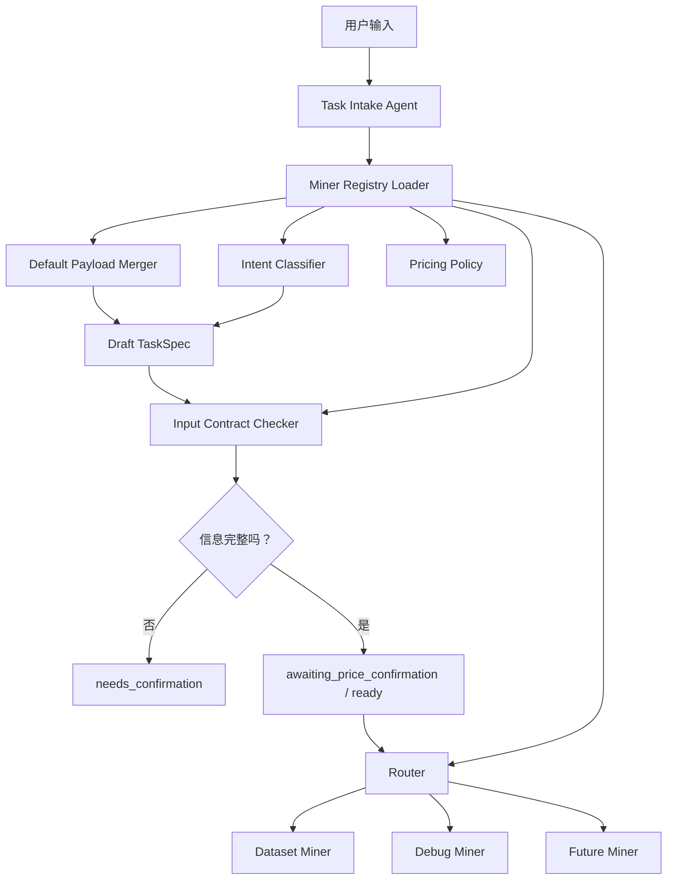

# Agent Architecture Plan 2.0

## 1. 目标

2.0 版把当前 Agent 系统从“入口 Agent 硬编码两个 Miner”升级为“Registry-driven Miner 插拔架构”。

核心目标：

- `TaskSpec` 仍然是所有 Miner 的统一输入协议
- 新增 Miner 时不改入口 Agent 主流程
- 每个 Miner 用一份 JSON 注册表声明能力、输入要求、默认配置、路由和执行入口
- 入口 Agent 通过注册表完成任务识别、字段补全、缺失信息检查、估价和路由
- Dataset Miner 和 Debug Miner 都变成注册表驱动

---

## 2. 总体结构



---

## 3. TaskSpec 2.0

`TaskSpec` 不再把所有字段平铺到顶层，而是升级成：

```text
common fields + typed payload
```

通用结构：

```json
{
  "task_id": "task_001",
  "task_type": "dataset_generation",
  "title": "Web3 漏洞数据集",
  "goal": "构建公开来源漏洞数据集",
  "requirements": [],
  "constraints": [],
  "suggested_price": 0.05,
  "user_budget": 0.05,
  "assigned_agent": "dataset_miner",
  "metadata": {
    "schema_version": "0.2.0"
  },
  "dataset": null,
  "debug": null
}
```

Dataset payload：

```json
{
  "dataset": {
    "target_size": 100,
    "output_format": "jsonl",
    "source_scope": ["osv"],
    "source_config": {
      "osv_packages": [
        {
          "ecosystem": "npm",
          "name": "@openzeppelin/contracts"
        }
      ]
    }
  }
}
```

Debug B 方案 payload：

```json
{
  "debug": {
    "debug_mode": "full_repo",
    "code_source": {
      "type": "git",
      "repo_url": "https://github.com/org/repo.git",
      "branch": "main",
      "commit": null,
      "public_only": true
    },
    "bug_description": "创建任务后列表不刷新",
    "expected_behavior": "新任务应出现在任务列表",
    "actual_behavior": "接口返回成功但 UI 没更新",
    "reproduction": {
      "test_command": "npm test",
      "logs": null,
      "entrypoint": null
    },
    "execution_policy": {
      "allow_patch": false,
      "allow_commands": ["npm test"],
      "timeout_seconds": 120,
      "cleanup_repo": true
    }
  }
}
```

兼容策略：

- 2.0 输出 typed payload
- Dataset Miner 暂时兼容旧顶层字段
- 新实现优先读取 `task_spec["dataset"]` 和 `task_spec["debug"]`

---

## 4. Miner Registry JSON

新增 Miner 至少需要一份注册表 JSON。

必填字段：

```json
{
  "schema_version": "0.1.0",
  "task_type": "code_debug",
  "miner_id": "debug_miner",
  "display_name": "Code Debug Miner",
  "description": "调试公开 Git 仓库中的代码问题。",
  "intent": {
    "keywords": ["debug", "bug", "报错", "修复"]
  },
  "input_contract": {
    "required_fields": [],
    "field_groups": []
  },
  "routing": {
    "assigned_agent": "debug_miner"
  },
  "execution": {
    "type": "local_python",
    "entrypoint": "aurora_agent_core.miners.debug_miner_graph:DebugMinerGraph"
  }
}
```

可默认字段：

```json
{
  "pricing": {
    "base": 0.05,
    "currency": "ETH",
    "unit_rules": []
  },
  "output_contract": {
    "artifact_types": ["report", "trace"]
  },
  "runtime_policy": {
    "timeout_seconds": 120,
    "allow_network": false,
    "allow_patch": false,
    "cleanup_workspace": true
  },
  "default_payload": {},
  "clarification": {
    "missing_field_questions": {}
  },
  "status_contract": {
    "success": ["completed"],
    "waiting": ["needs_confirmation", "awaiting_price_confirmation"],
    "failure": ["failed"]
  }
}
```

---

## 5. 完整性检查规则

入口 Agent 不再手写每个 Miner 缺什么字段，只读取：

```json
{
  "input_contract": {
    "required_fields": [],
    "field_groups": []
  }
}
```

单字段必填：

```json
{
  "required_fields": [
    "dataset.target_size",
    "dataset.output_format",
    "dataset.source_scope"
  ]
}
```

多选一字段：

```json
{
  "field_groups": [
    {
      "name": "reproduction_evidence",
      "mode": "any_of",
      "fields": [
        "debug.reproduction.test_command",
        "debug.reproduction.logs"
      ],
      "message": "请提供复现命令或错误日志。"
    }
  ]
}
```

入口 Agent 缺失信息输出：

```json
{
  "status": "needs_confirmation",
  "missing_fields": [
    "debug.code_source.repo_url",
    "reproduction_evidence"
  ],
  "agent_message": "还需要公开 Git 仓库 URL，以及复现命令或错误日志。"
}
```

---

## 6. Dataset Miner 注册表

```json
{
  "schema_version": "0.1.0",
  "task_type": "dataset_generation",
  "miner_id": "dataset_miner",
  "display_name": "Dataset Miner",
  "description": "从公开来源构建结构化数据集。",
  "intent": {
    "keywords": ["数据集", "dataset", "jsonl", "csv", "样本"]
  },
  "input_contract": {
    "required_fields": [
      "dataset.target_size",
      "dataset.output_format",
      "dataset.source_scope"
    ],
    "field_groups": []
  },
  "default_payload": {
    "dataset": {
      "output_format": "jsonl",
      "source_scope": ["public_web"],
      "source_config": {}
    }
  },
  "pricing": {
    "base": 0.05,
    "currency": "ETH"
  },
  "routing": {
    "assigned_agent": "dataset_miner"
  },
  "execution": {
    "type": "local_python",
    "entrypoint": "aurora_agent_core.miners.dataset_miner_graph:DatasetMinerGraph"
  },
  "output_contract": {
    "artifact_types": ["dataset", "sources", "stats", "report", "trace"]
  }
}
```

---

## 7. Debug Miner B 方案注册表

```json
{
  "schema_version": "0.1.0",
  "task_type": "code_debug",
  "miner_id": "debug_miner",
  "display_name": "Code Debug Miner",
  "description": "调试公开 Git 仓库中的代码问题。",
  "intent": {
    "keywords": ["debug", "bug", "报错", "修复", "patch", "代码"]
  },
  "input_contract": {
    "required_fields": [
      "debug.code_source.type",
      "debug.code_source.repo_url",
      "debug.bug_description"
    ],
    "field_groups": [
      {
        "name": "reproduction_evidence",
        "mode": "any_of",
        "fields": [
          "debug.reproduction.test_command",
          "debug.reproduction.logs"
        ],
        "message": "请提供复现命令或错误日志。"
      }
    ]
  },
  "default_payload": {
    "debug": {
      "debug_mode": "full_repo",
      "code_source": {
        "type": "git",
        "branch": "main",
        "commit": null,
        "public_only": true
      },
      "reproduction": {
        "test_command": null,
        "logs": null,
        "entrypoint": null
      },
      "execution_policy": {
        "allow_patch": false,
        "allow_commands": [],
        "timeout_seconds": 120,
        "cleanup_repo": true
      }
    }
  },
  "pricing": {
    "base": 0.12,
    "currency": "ETH"
  },
  "routing": {
    "assigned_agent": "debug_miner"
  },
  "execution": {
    "type": "local_python",
    "entrypoint": "aurora_agent_core.miners.debug_miner_graph:DebugMinerGraph"
  },
  "output_contract": {
    "artifact_types": ["debug_report", "patch", "verification", "logs", "trace"]
  }
}
```

---

## 8. 新增 Miner 流程

```text
1. 新增 registry/{miner_id}.json
2. 实现 Miner.run(task_spec, output_dir=None)
3. 注册表 execution.entrypoint 指向 Miner 类
4. 测试 registry loader、完整性检查、router 和 runner
```

新增 Miner 不应修改 Task Intake Graph 主流程。

---

## 9. 当前迁移计划

第一阶段：

- 新增 registry JSON
- 新增 registry loader/validator
- Router 从 registry 读取 assigned_agent
- Runner 从 registry execution.entrypoint 动态加载 Miner
- TaskSpec 同时保留旧平铺字段和新 typed payload

第二阶段：

- Task Intake Graph 的 missing info 改为读取 input_contract
- Dataset Miner 优先读取 `task_spec.dataset`
- Debug Miner 读取 `task_spec.debug`

第三阶段：

- 删除硬编码路由表
- 删除旧平铺字段依赖

