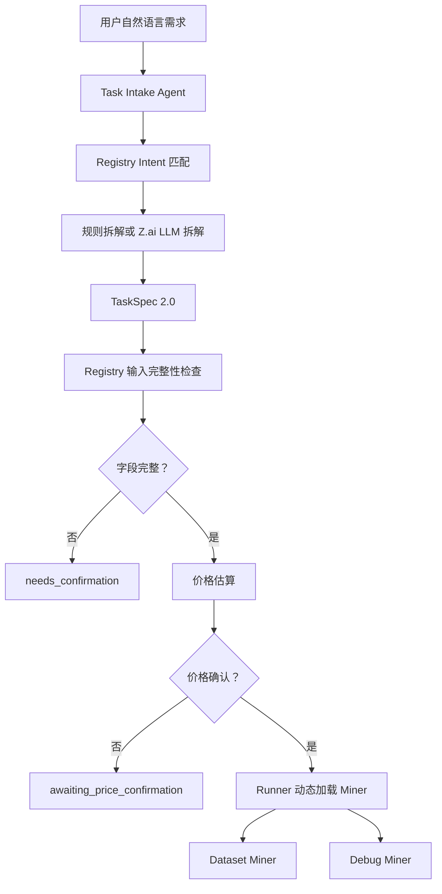
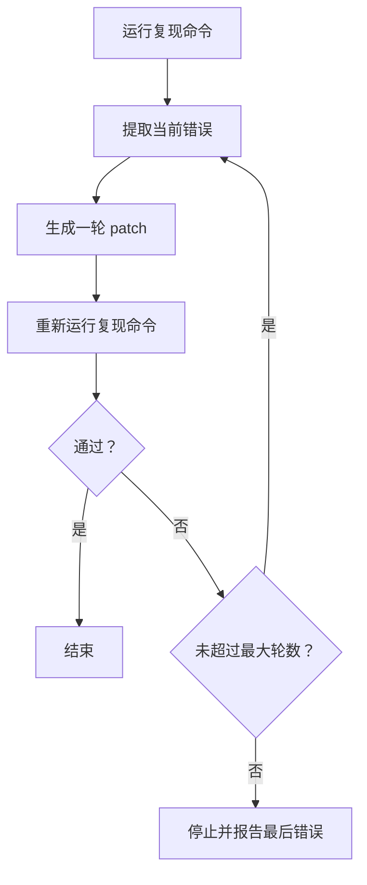
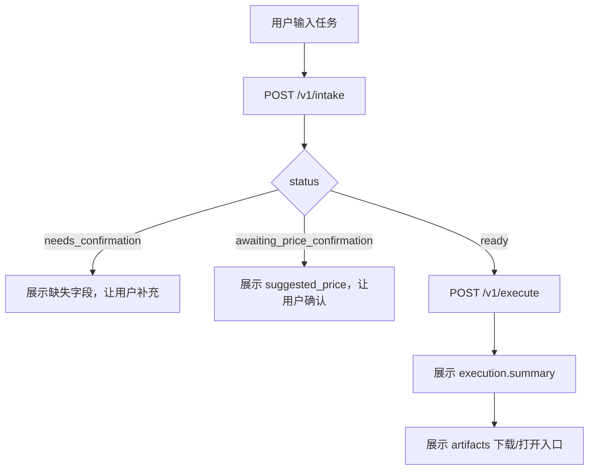

# Aurora Agent Core 使用说明

这份文档给前端、后端和 Agent/Miner 开发同学使用，说明当前 `aurora-agent-core` 已经实现的能力、调用方式、输入输出结构、真实示例和注意事项。

## 1. 当前已实现能力



已实现：

- `TaskIntakeGraph`：用户需求受理、任务类型识别、字段拆解、缺失字段检查、价格确认。
- `DatasetMinerGraph`：支持 OSV Public API 真实漏洞数据，也支持 MVP synthetic 数据。
- `DebugMinerGraph`：支持公开 GitHub 仓库 clone、复现命令执行、失败信号分析、候选文件定位、patch loop、修改后仓库保留。
- `Miner Registry`：新增 miner 通过 JSON 注册表声明能力、输入契约、路由和执行入口。
- `Z.ai`：OpenAI-compatible 调用，已测 `glm-4.5-flash` 和 `glm-5.1`。

当前边界：

- Debug patch loop 在 `use_llm=true` 时每轮先调用 Z.ai 生成受限 patch plan，再用启发式规则兜底；不保证所有仓库都修到测试全绿。
- Debug 默认不 patch；用户明确说“修复 / patch / 改代码 / 保留仓库 / 修改后的代码”时才会开启 patch mode。
- 目前不直接提交用户 GitHub 仓库，默认返回 artifact；后续可升级为授权后建分支/PR。

## 2. 环境准备

推荐使用 conda：

```bash
cd /Users/root1/Desktop/hackathon/bittenssor-pro/aurora-agent-core
conda env create -f environment.yml
conda activate aurora-agent-core
```

如果环境已经建好：

```bash
conda activate aurora-agent-core
```

也可以直接使用当前机器上的环境：

```bash
/Users/root1/miniconda3/envs/aurora-agent-core/bin/python -m pytest -q
```

## 3. Z.ai 配置

复制示例配置：

```bash
cp .env.example .env
```

普通 PaaS 模型示例：

```bash
ZAI_API_KEY=你的_zai_key
AURORA_MODEL=glm-4.5-flash
AURORA_BASE_URL=https://api.z.ai/api/paas/v4/
```

GLM-5.1 Coding Plan 示例：

```bash
ZAI_API_KEY=你的_zai_key
AURORA_MODEL=glm-5.1
AURORA_BASE_URL=https://api.z.ai/api/coding/paas/v4
```

Smoke test：

```bash
python -m aurora_agent_core.llm.zai_client "只返回一句话：Z.ai 连通正常"
```

安全提醒：

- `.env` 已被 `.gitignore` 忽略，不要提交。
- `.env.example` 只能放占位值。

## 4. 启动 API 服务

```bash
python -m aurora_agent_core.api
```

默认地址：

```text
http://127.0.0.1:8791
```

核心接口：

```text
GET  /health
POST /v1/intake
POST /v1/execute
```

## 5. 后端调用方式

### 5.1 Health Check

请求：

```bash
curl -s http://127.0.0.1:8791/health
```

示例输出：

```json
{
  "status": "ok",
  "service": "aurora-agent-core"
}
```

### 5.2 只做任务受理 `/v1/intake`

用途：

- 前端用户输入自然语言后，先调用 intake。
- 如果返回 `needs_confirmation`，前端展示缺失字段。
- 如果返回 `awaiting_price_confirmation`，前端展示建议价格，让用户确认。
- 如果返回 `ready`，前端可以继续调用 execute。

请求体字段：

```json
{
  "user_input": "用户自然语言需求",
  "price_confirmed": false,
  "user_budget": null,
  "use_llm": false
}
```

字段说明：

| 字段 | 类型 | 说明 |
|---|---|---|
| `user_input` | string | 用户需求，必填 |
| `price_confirmed` | boolean | 用户是否确认价格 |
| `user_budget` | number/null | 用户预算，不传则用建议价格 |
| `use_llm` | boolean | 是否使用 Z.ai 做任务拆解 |

`use_llm=true` 会同时写入 `TaskSpec.metadata.use_llm`，Debug Miner 的 patch loop 会继承这个开关。后端也兼容 `TaskSpec.metadata.llm.enabled=true`，方便以后前端或编排层用更结构化的模型配置。

Dataset intake 示例：

```bash
curl -s http://127.0.0.1:8791/v1/intake \
  -H 'Content-Type: application/json' \
  -d '{
    "user_input":"帮我构建 2 条 Web3 漏洞数据集，来源 osv，npm:@openzeppelin/contracts，输出 jsonl"
  }'
```

典型输出：

```json
{
  "status": "awaiting_price_confirmation",
  "agent_message": "任务已经足够清晰，建议价格为 0.052 ETH。请确认或修改预算。",
  "missing_fields": [],
  "suggested_price": 0.052,
  "ready": false,
  "draft_task": {
    "task_type": "dataset_generation",
    "target_size": 2,
    "output_format": "jsonl",
    "source_scope": ["osv"],
    "source_config": {
      "osv_packages": [
        {"ecosystem": "npm", "name": "@openzeppelin/contracts"}
      ]
    }
  }
}
```

缺字段示例：

```bash
curl -s http://127.0.0.1:8791/v1/intake \
  -H 'Content-Type: application/json' \
  -d '{"user_input":"帮我构建 Web3 漏洞数据集，输出 jsonl，来源 osv"}'
```

输出重点：

```json
{
  "status": "needs_confirmation",
  "missing_fields": ["dataset.target_size"],
  "ready": false
}
```

确认价格示例：

```bash
curl -s http://127.0.0.1:8791/v1/intake \
  -H 'Content-Type: application/json' \
  -d '{
    "user_input":"帮我构建 2 条 Web3 漏洞数据集，来源 osv，npm:@openzeppelin/contracts，输出 jsonl",
    "price_confirmed":true,
    "user_budget":0.1
  }'
```

输出重点：

```json
{
  "status": "ready",
  "ready": true,
  "task_spec": {
    "task_type": "dataset_generation",
    "assigned_agent": "dataset_miner",
    "metadata": {"schema_version": "0.2.0"},
    "dataset": {
      "target_size": 2,
      "output_format": "jsonl",
      "source_scope": ["osv"]
    }
  }
}
```

### 5.3 执行任务 `/v1/execute`

用途：

- 后端或前端在用户确认价格后调用。
- API 内部会走 `TaskIntakeGraph -> Router -> Miner` 全链路。

请求体字段：

```json
{
  "user_input": "用户自然语言需求",
  "price_confirmed": true,
  "user_budget": 0.1,
  "use_llm": false,
  "output_dir": "artifacts/my_run"
}
```

`output_dir` 可选：

- 不传：输出到 `artifacts/{task_id}`。
- 传入：输出到指定目录。

## 6. Dataset Miner 使用说明

### 6.1 支持输入

Dataset Miner 由 `TaskSpec.dataset` 驱动：

```json
{
  "task_type": "dataset_generation",
  "dataset": {
    "target_size": 2,
    "output_format": "jsonl",
    "source_scope": ["osv"],
    "source_config": {
      "osv_packages": [
        {"ecosystem": "npm", "name": "@openzeppelin/contracts"}
      ]
    }
  }
}
```

必填字段由 `registry/dataset_miner.json` 声明：

```json
[
  "goal",
  "dataset.target_size",
  "dataset.output_format",
  "dataset.source_scope"
]
```

### 6.2 OSV 真实数据执行示例

```bash
curl -s http://127.0.0.1:8791/v1/execute \
  -H 'Content-Type: application/json' \
  -d '{
    "user_input":"帮我构建 2 条 Web3 漏洞数据集，来源 osv，npm:@openzeppelin/contracts，输出 jsonl",
    "price_confirmed":true,
    "output_dir":"artifacts/team_demo_dataset"
  }'
```

真实跑通过的输出摘要：

```json
{
  "intake": {
    "status": "ready",
    "task_spec": {
      "assigned_agent": "dataset_miner",
      "dataset": {
        "target_size": 2,
        "output_format": "jsonl",
        "source_scope": ["osv"],
        "source_config": {
          "osv_packages": [
            {"ecosystem": "npm", "name": "@openzeppelin/contracts"}
          ]
        }
      }
    }
  },
  "execution": {
    "status": "completed",
    "summary": {
      "records": 2,
      "sources_used": 1,
      "real_source_records": 2,
      "synthetic_records": 0,
      "output_format": "jsonl"
    }
  }
}
```

### 6.3 Dataset artifacts

Dataset Miner 输出：

```text
output_dir/
  dataset.jsonl
  sources.json
  stats.json
  report.md
  trace.json
  result.json
```

文件说明：

| 文件 | 说明 |
|---|---|
| `dataset.jsonl` | 最终数据集 |
| `sources.json` | 使用的数据源和查询信息 |
| `stats.json` | 统计信息 |
| `report.md` | 人类可读报告 |
| `trace.json` | LangGraph 节点执行轨迹 |
| `result.json` | 结构化执行结果 |

## 7. Debug Miner 使用说明

### 7.1 支持输入

Debug Miner 由 `TaskSpec.debug` 驱动：

```json
{
  "task_type": "code_debug",
  "debug": {
    "debug_mode": "full_repo",
    "code_source": {
      "type": "git",
      "repo_url": "https://github.com/org/repo",
      "branch": "main",
      "commit": null,
      "public_only": true
    },
    "bug_description": "测试失败",
    "expected_behavior": "测试全部通过",
    "actual_behavior": "No module named tasks",
    "reproduction": {
      "test_command": "python -m pytest -q",
      "logs": null,
      "entrypoint": null
    },
    "execution_policy": {
      "allow_patch": true,
      "allow_commands": ["python -m pytest -q"],
      "timeout_seconds": 120,
      "cleanup_repo": false
    }
  }
}
```

必填字段由 `registry/debug_miner.json` 声明：

```json
[
  "goal",
  "debug.code_source.type",
  "debug.code_source.repo_url",
  "debug.bug_description"
]
```

还需要二选一：

```json
[
  "debug.reproduction.test_command",
  "debug.reproduction.logs"
]
```

### 7.2 Debug 诊断模式

如果用户没有明确要求修复：

```bash
curl -s http://127.0.0.1:8791/v1/execute \
  -H 'Content-Type: application/json' \
  -d '{
    "user_input":"帮我 debug 这个公开 GitHub 仓库 https://github.com/jashburn8020/python-testing-with-pytest，测试命令 python -m pytest -q，期望：测试全部通过，实际：No module named tasks",
    "price_confirmed":true,
    "output_dir":"artifacts/team_demo_debug_diagnose"
  }'
```

行为：

- clone 公开 GitHub 仓库。
- 运行复现命令。
- 提取失败信号。
- 定位候选文件。
- 默认 `cleanup_repo=true`，跑完清理临时 clone。
- 只输出报告和 runtime，不输出 `modified_repo`。

输出摘要：

```json
{
  "execution": {
    "status": "diagnosed",
    "summary": {
      "reproduced": true,
      "returncode": 2,
      "candidate_files": 12,
      "patch_generated": false,
      "cleanup_repo": true
    }
  }
}
```

### 7.3 Debug patch loop 模式

用户自然语言里出现以下词，会开启 patch mode：

```text
修复 / patch / 改代码 / 提交补丁 / 修改后的代码 / 保留仓库
```

示例：

```bash
curl -s http://127.0.0.1:8791/v1/execute \
  -H 'Content-Type: application/json' \
  -d '{
    "user_input":"帮我修复这个公开 GitHub 仓库 https://github.com/jashburn8020/python-testing-with-pytest，测试命令 python -m pytest -q，期望：测试全部通过，实际：No module named tasks，保留仓库，我要看修改后的代码",
    "price_confirmed":true,
    "output_dir":"artifacts/team_demo_debug_patch"
  }'
```

当前 patch loop：



真实跑通过的示例结果：

```json
{
  "execution": {
    "status": "diagnosed",
    "summary": {
      "reproduced": true,
      "returncode": 2,
      "patch_generated": true,
      "verification_returncode": 2,
      "patch_iterations": 3,
      "cleanup_repo": false
    },
    "debug": {
      "patch_iterations": [
        {
          "iteration": 1,
          "strategy": "pytest_pythonpath_conftest",
          "reason": "Added pytest path bootstrap for missing module 'tasks'.",
          "files_modified": ["conftest.py"],
          "verification_returncode": 2
        },
        {
          "iteration": 2,
          "strategy": "stub_module",
          "reason": "Added a minimal local six.py compatibility shim.",
          "files_modified": ["six.py"],
          "verification_returncode": 2
        },
        {
          "iteration": 3,
          "strategy": "pytest_pythonpath_conftest",
          "reason": "Patch marker already exists.",
          "files_modified": []
        }
      ]
    }
  }
}
```

说明：

- 示例仓库第一层错误是 `No module named tasks`，已生成 `conftest.py` 修复路径。
- 第二层错误是 `No module named six`，已生成 `six.py` 最小 shim。
- 第三层出现 `func.*` 路径问题，当前没有安全启发式，所以停止。
- 因为 `cleanup_repo=false`，会保留修改后的仓库。

### 7.4 Debug artifacts

诊断模式输出：

```text
output_dir/
  debug_report.md
  repo_context.json
  runtime.json
  trace.json
  result.json
```

patch mode 额外输出：

```text
output_dir/
  patch.diff
  workspace/repo/
```

文件说明：

| 文件 | 说明 |
|---|---|
| `debug_report.md` | 人类可读诊断报告 |
| `repo_context.json` | 仓库结构扫描结果 |
| `runtime.json` | 复现命令 stdout/stderr/returncode |
| `trace.json` | LangGraph 节点执行轨迹 |
| `result.json` | 结构化执行结果 |
| `patch.diff` | Debug Miner 生成的补丁 |
| `workspace/repo/` | 修改后的完整项目代码 |

给用户交付时建议打包：

```text
debug_result.zip
  README_APPLY_PATCH.md
  patch.diff
  debug_report.md
  result.json
  runtime.json
  trace.json
  repo_context.json
  modified_repo/
```

`README_APPLY_PATCH.md` 的作用：

- 告诉用户每个文件是什么。
- 告诉用户如何在原仓库执行 `git apply patch.diff`。
- 告诉用户如何运行验证命令。
- 告诉用户如果没有修到全绿，下一层错误在哪里看。

当前代码还没有自动生成 zip 和 `README_APPLY_PATCH.md`，这是下一步建议实现的交付层。

## 8. 前端接入建议

### 8.1 推荐页面流程



### 8.2 前端需要处理的 status

| status | 前端动作 |
|---|---|
| `rejected` | 展示不支持原因 |
| `needs_confirmation` | 展示 `missing_fields` 并让用户补充 |
| `awaiting_price_confirmation` | 展示价格确认组件 |
| `ready` | 可以执行任务 |
| `completed` | Dataset 成功 |
| `diagnosed` | Debug 已诊断，可能生成 patch |
| `no_repro` | Debug 复现命令未失败 |
| `failed` | clone 或输入失败 |

### 8.3 前端展示 artifact

Dataset：

- `dataset`：下载数据集。
- `report`：展示报告。
- `trace`：展示执行时间线。

### 8.4 前端展示 usage / token 消耗

`/v1/intake` 会返回 `usage`：

```json
{
  "usage": {
    "agent": "task_intake",
    "llm": {
      "provider": "zai",
      "model": "glm-4.5-flash",
      "base_url": "https://api.z.ai/api/paas/v4/",
      "prompt_tokens": 371,
      "completion_tokens": 876,
      "total_tokens": 1247,
      "max_tokens": 1200
    },
    "pricing": {
      "suggested_price": 0.052,
      "user_budget": null,
      "currency": "ETH"
    }
  }
}
```

说明：

- `usage.llm` 只有 `use_llm=true` 且 Z.ai 调用成功时才有值。
- 规则拆解不消耗 LLM token，`usage.llm` 为 `null`。
- `max_tokens` 是本次请求的生成上限配置，不等于总 token。
- 如果 Z.ai 返回 usage，系统会把它写入 response、trace，并在 ready 状态下写入 `task_spec.metadata.llm_usage`。

`/v1/execute` 的 `execution.usage` 记录 miner 运行指标。

Dataset 示例：

```json
{
  "execution": {
    "usage": {
      "miner": "dataset_miner",
      "records_requested": 2,
      "records_output": 2,
      "sources_used": 1,
      "source_api_calls": 1,
      "extraction_method": "osv_api",
      "real_source_records": 2,
      "synthetic_records": 0,
      "output_format": "jsonl",
      "llm": null,
      "llm_total_tokens": null
    }
  }
}
```

Dataset Miner 在 `use_llm=true` 时也会统计自己的模型消耗：

- OSV 数据仍来自真实公开 API，Z.ai 不会伪造 OSV 记录。
- 非 OSV 的 synthetic dataset 会用 Z.ai 生成结构化记录，并在 provenance 中标记 `synthetic_mvp=true`、`model_generated=true`。
- Dataset 报告在 `use_llm=true` 时由 Z.ai 生成，报告生成 token 也计入 `execution.usage.llm`。

Debug 示例：

```json
{
  "execution": {
    "usage": {
      "miner": "debug_miner",
      "repo_cloned": true,
      "commands_run": 3,
      "initial_returncode": 2,
      "patch_iterations": 2,
      "patch_generated": true,
      "files_modified": 2,
      "verification_returncode": 0,
      "cleanup_repo": false
    }
  }
}
```

Debug patch loop 使用模型时，`execution.usage.llm` 会记录 Debug Miner 自己消耗的 token，和第一个 Task Intake Agent 的 token 分开统计：

```json
{
  "intake": {
    "usage": {
      "llm": {
        "model": "glm-4.5-flash",
        "prompt_tokens": 396,
        "completion_tokens": 1051,
        "total_tokens": 1447
      }
    }
  },
  "execution": {
    "usage": {
      "miner": "debug_miner",
      "patch_iterations": 3,
      "commands_run": 4,
      "llm": {
        "model": "glm-4.5-flash",
        "calls": 4,
        "prompt_tokens": 12000,
        "completion_tokens": 1800,
        "total_tokens": 13800
      },
      "llm_total_tokens": 13800
    }
  }
}
```

当前接入模型的位置：

- `Task Intake Agent`：`use_llm=true` 时用 Z.ai 拆解用户需求。
- `Debug Miner patch loop`：如果 `execution_policy.use_llm=true`、`metadata.use_llm=true` 或 `metadata.llm.enabled=true`，每一轮 patch 都先调用 Z.ai 生成受限 JSON patch plan；模型无法生成安全补丁时，才用启发式规则兜底。
- `Debug Miner report`：`use_llm=true` 时用 Z.ai 生成 Markdown 错误报告，token 合并进 `execution.usage.llm`。
- `Dataset Miner extraction`：`use_llm=true` 且没有真实 OSV connector 时，用 Z.ai 生成 synthetic dataset records。
- `Dataset Miner report`：`use_llm=true` 时用 Z.ai 生成数据集报告，token 合并进 `execution.usage.llm`。
- 报告文件末尾会由程序追加 `Usage Accounting`，这里的 token 是精确统计；如果模型正文自己写了 token 注释，以程序追加段和 `result.json` 为准。

这里的“启发式”指固定安全规则，不是模型推理。目前 Debug Miner 的启发式包括：

- 看到 `No module named tasks` 且仓库里能找到 `tasks` 包时，生成 pytest `conftest.py`，把对应 source root 加进 `sys.path`。
- 看到安全白名单里的缺失模块，例如 `six`，生成最小本地 shim。
- 没有匹配规则时不强行改代码，等待 Z.ai patch plan 或输出诊断报告。

Debug：

- `debug_report`：展示诊断报告。
- `runtime`：展示命令输出。
- `patch`：下载 patch。
- `modified_repo`：提示后端打包下载，或展示路径。
- `trace`：展示执行时间线。

## 9. 后端接入建议

后端可以直接调用 Python 函数：

```python
from aurora_agent_core.runner import run_aurora_task

result = run_aurora_task(
    {
        "user_input": "帮我构建 2 条 Web3 漏洞数据集，来源 osv，npm:@openzeppelin/contracts，输出 jsonl",
        "price_confirmed": True,
    },
    output_dir="artifacts/backend_dataset_run",
)
```

也可以只跑 intake：

```python
from aurora_agent_core.agents.task_intake_graph import TaskIntakeGraph

result = TaskIntakeGraph().run(
    {
        "user_input": "帮我 debug 这个仓库 https://github.com/org/repo，测试命令 python -m pytest",
        "use_llm": True,
    }
)
```

CLI 调用同样支持模型开关：

```bash
python -m aurora_agent_core.cli \
  --use-llm \
  --price-confirmed \
  --output-dir artifacts/debug_cli_run \
  "帮我修复公开 GitHub 仓库 https://github.com/example/project，测试命令 python -m pytest -q，保留仓库，我要看修改后的代码"
```

CLI 的 `--use-llm` 和 API 的 `use_llm=true` 等价，会传给 Task Intake Agent，并继续进入支持模型的 miner loop。

直接跑 Dataset Miner：

```python
from aurora_agent_core.miners.dataset_miner_graph import DatasetMinerGraph

result = DatasetMinerGraph().run(task_spec, output_dir="artifacts/dataset_direct")
```

直接跑 Debug Miner：

```python
from aurora_agent_core.miners.debug_miner_graph import DebugMinerGraph

result = DebugMinerGraph().run(task_spec, output_dir="artifacts/debug_direct")
```

## 10. Registry 新增 Miner 方式

当前 registry 在：

```text
registry/dataset_miner.json
registry/debug_miner.json
```

新增 miner 需要：

1. 新增一份 `registry/{miner_id}.json`。
2. 声明 `task_type`、`intent.keywords`、`input_contract`、`routing.assigned_agent`。
3. 声明 `execution.entrypoint`，格式为 `python.module:ClassName`。
4. 实现 `Miner.run(task_spec, output_dir=None)`。
5. 添加测试。

入口 Agent 不需要新增硬编码分支。

## 11. 常见问题

### 为什么有时只返回报告，没有 modified_repo？

因为 Debug 默认是诊断模式：

```json
"allow_patch": false
```

需要用户明确说“修复、patch、改代码、保留仓库、修改后的代码”，才会：

```json
"allow_patch": true,
"cleanup_repo": false
```

### 为什么 patch_generated=true 但测试没全绿？

Debug Miner 是多轮修复和验证。`use_llm=true` 时每一轮都会先调用 Z.ai 生成受限 patch plan，然后运行复现命令验证；如果模型没有给出可安全落地的补丁，才使用固定启发式兜底。`patch_generated=true` 只表示本轮确实改过代码，不等于最终测试已经全绿。它会保留：

- 已修改的代码
- `patch.diff`
- 最后一轮 `runtime.json`
- `debug_report.md`

### artifacts 要不要提交？

不要。`artifacts/` 是运行产物，已经在 `.gitignore` 里。

### .env 要不要提交？

不要。`.env` 是本地密钥文件，已经在 `.gitignore` 里。

### pytest 为什么只跑 tests？

因为 patch mode 会保留外部 GitHub 仓库到 `artifacts/.../workspace/repo`。如果 pytest 扫全项目，会误收集这些外部仓库的测试。`pyproject.toml` 已限制：

```toml
[tool.pytest.ini_options]
testpaths = ["tests"]
pythonpath = ["."]
```

## 12. 提交前检查

```bash
cd /Users/root1/Desktop/hackathon/bittenssor-pro/aurora-agent-core
PYTHONDONTWRITEBYTECODE=1 /Users/root1/miniconda3/envs/aurora-agent-core/bin/python -m pytest -q -p no:cacheprovider
```

期望：

```text
25 passed, 1 warning
```

从仓库根目录确认不会提交密钥和 artifacts：

```bash
cd /Users/root1/Desktop/hackathon/bittenssor-pro
git add -n aurora-agent-core
```

不应该出现：

```text
aurora-agent-core/.env
aurora-agent-core/artifacts/
__pycache__
.pytest_cache
```
