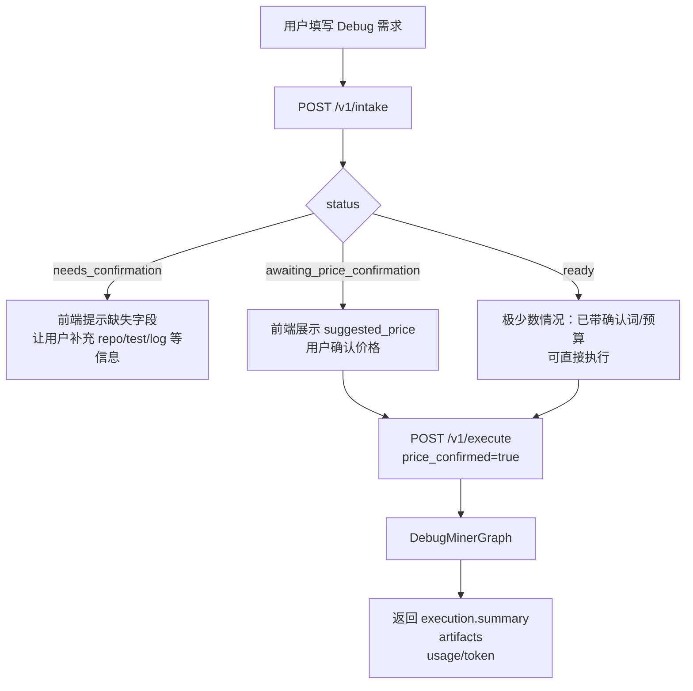
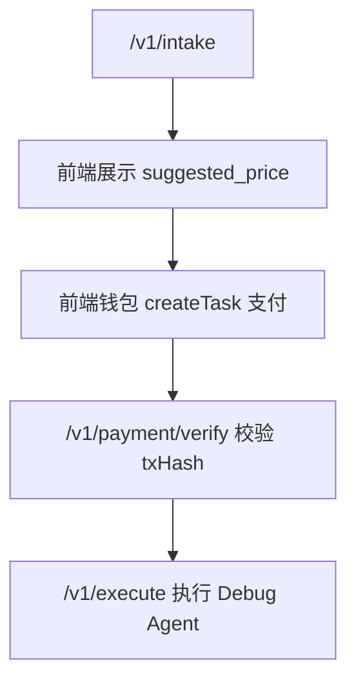

# 前端对接 Debug Agent 流程

本文档描述当前已经实现的 **Agent 后端 -> Debug Miner** 流程。当前版本还没有接入 Sepolia 支付验证，所以价格确认只是前端让用户确认预算；后续接支付时，会在 `intake ready` 和 `execute` 中间加 `payment verify`。

## 1. 服务地址

默认本地服务：

```text
http://127.0.0.1:8791
```

启动方式：

```bash
cd aurora-agent-core
python -m aurora_agent_core.api
```

健康检查：

```http
GET /health
```

## 2. 总体流程



## 3. 第一步：调用 Intake 获取任务拆解和价格

接口：

```http
POST /v1/intake
```

请求 JSON：

```json
{
  "user_input": "帮我修复这个公开 GitHub 仓库 https://github.com/example/project，测试命令 python -m pytest -q，期望：测试全部通过，实际：No module named tasks，保留仓库，我要看修改后的代码",
  "use_llm": true
}
```

字段说明：

| 字段 | 类型 | 必填 | 说明 |
|---|---:|---:|---|
| `user_input` | string | 是 | 用户自然语言 Debug 需求 |
| `use_llm` | boolean | 否 | 是否用 Z.ai 拆解需求，建议 Debug 流程传 `true` |
| `price_confirmed` | boolean | 否 | 第一次 intake 通常不传或传 `false` |
| `user_budget` | number/null | 否 | 第一次 intake 通常不传 |

`user_input` 最好包含：

```text
1. GitHub 仓库 URL
2. 测试命令
3. 期望行为
4. 实际错误
5. 是否允许改代码
```

如果希望 Debug Agent 自动生成 patch，需要让用户输入里包含类似词：

```text
修复
patch
改代码
提交补丁
修改后的代码
保留仓库
我要看修改后的代码
```

这些词会让后端解析出：

```json
{
  "execution_policy": {
    "allow_patch": true,
    "cleanup_repo": false
  }
}
```

## 4. Intake 可能返回的状态

### 4.1 `needs_confirmation`

说明：用户信息不够，不能报价或执行。

典型返回：

```json
{
  "status": "needs_confirmation",
  "ready": false,
  "missing_fields": [
    "debug.code_source.repo_url",
    "reproduction_evidence"
  ],
  "agent_message": "我已经理解任务方向，但还需要补充：debug.code_source.repo_url、reproduction_evidence。"
}
```

前端处理：

```text
展示 missing_fields 和 agent_message，让用户补充仓库地址、测试命令或错误日志。
补充后重新调用 /v1/intake。
```

### 4.2 `awaiting_price_confirmation`

说明：任务信息完整，后端已经给出建议价格，但用户还没确认。

典型返回：

```json
{
  "status": "awaiting_price_confirmation",
  "agent_message": "任务已经足够清晰，建议价格为 0.12 ETH。请确认或修改预算。",
  "draft_task": {
    "task_type": "code_debug",
    "title": "代码 Debug 任务",
    "goal": "帮我修复这个公开 GitHub 仓库 ...",
    "debug": {
      "code_source": {
        "type": "git",
        "repo_url": "https://github.com/example/project",
        "branch": null,
        "commit": null,
        "public_only": true
      },
      "bug_description": "帮我修复这个公开 GitHub 仓库 ...",
      "expected_behavior": "测试全部通过",
      "actual_behavior": "No module named tasks",
      "reproduction": {
        "test_command": "python -m pytest -q",
        "logs": null,
        "entrypoint": null
      },
      "execution_policy": {
        "allow_patch": true,
        "allow_commands": ["python -m pytest -q"],
        "timeout_seconds": 120,
        "cleanup_repo": false
      }
    }
  },
  "missing_fields": [],
  "suggested_price": 0.12,
  "user_budget": null,
  "ready": false,
  "usage": {
    "agent": "task_intake",
    "llm": {
      "provider": "zai",
      "model": "glm-4.5-flash",
      "total_tokens": 1400
    },
    "pricing": {
      "suggested_price": 0.12,
      "user_budget": null,
      "currency": "ETH"
    }
  }
}
```

前端处理：

```text
展示价格确认弹窗：
预计价格：suggested_price ETH
[确认并执行] [修改预算] [取消]
```

前端需要临时保存：

```json
{
  "user_input": "原始用户输入",
  "suggested_price": 0.12,
  "draft_task": {}
}
```

### 4.3 `ready`

说明：用户已经确认预算或输入里带了确认词。通常前端第一步不会直接拿到这个状态，除非请求里传了 `price_confirmed=true` 或 `user_budget`。

## 5. 第二步：用户确认价格后执行 Debug Agent

接口：

```http
POST /v1/execute
```

请求 JSON：

```json
{
  "user_input": "帮我修复这个公开 GitHub 仓库 https://github.com/example/project，测试命令 python -m pytest -q，期望：测试全部通过，实际：No module named tasks，保留仓库，我要看修改后的代码",
  "price_confirmed": true,
  "user_budget": 0.12,
  "use_llm": true,
  "output_dir": "artifacts/frontend_debug_run"
}
```

字段说明：

| 字段 | 类型 | 必填 | 说明 |
|---|---:|---:|---|
| `user_input` | string | 是 | 必须和 intake 阶段使用同一份用户需求，或包含同等信息 |
| `price_confirmed` | boolean | 是 | 要执行 miner 必须为 `true` |
| `user_budget` | number/null | 否 | 可传 intake 返回的 `suggested_price` |
| `use_llm` | boolean | 否 | 建议传 `true`，Debug patch loop 和报告会使用 Z.ai |
| `output_dir` | string/null | 否 | 产物输出目录，不传则自动生成 |

注意：

```text
当前 /v1/execute 会重新跑一次 TaskIntakeGraph，再路由到 DebugMinerGraph。
所以 execute 请求必须再次包含完整 user_input。
```

## 6. Execute 返回结构

典型返回：

```json
{
  "intake": {
    "status": "ready",
    "ready": true,
    "suggested_price": 0.12,
    "user_budget": 0.12,
    "task_spec": {
      "task_type": "code_debug",
      "assigned_agent": "debug_miner",
      "debug": {
        "code_source": {
          "type": "git",
          "repo_url": "https://github.com/example/project",
          "public_only": true
        },
        "reproduction": {
          "test_command": "python -m pytest -q"
        },
        "execution_policy": {
          "allow_patch": true,
          "cleanup_repo": false,
          "timeout_seconds": 120
        }
      }
    }
  },
  "execution": {
    "task_id": "task_xxx",
    "status": "diagnosed",
    "summary": {
      "repo_url": "https://github.com/example/project",
      "test_command": "python -m pytest -q",
      "reproduced": true,
      "returncode": 2,
      "candidate_files": 12,
      "patch_generated": true,
      "verification_returncode": 2,
      "patch_iterations": 3,
      "cleanup_repo": false
    },
    "artifacts": [
      {
        "type": "debug_report",
        "path": "artifacts/frontend_debug_run/debug_report.md"
      },
      {
        "type": "repo_context",
        "path": "artifacts/frontend_debug_run/repo_context.json"
      },
      {
        "type": "runtime",
        "path": "artifacts/frontend_debug_run/runtime.json"
      },
      {
        "type": "trace",
        "path": "artifacts/frontend_debug_run/trace.json"
      },
      {
        "type": "patch",
        "path": "artifacts/frontend_debug_run/patch.diff"
      },
      {
        "type": "modified_repo",
        "path": "artifacts/frontend_debug_run/workspace/repo"
      }
    ],
    "usage": {
      "miner": "debug_miner",
      "repo_cloned": true,
      "commands_run": 4,
      "initial_returncode": 2,
      "patch_iterations": 3,
      "patch_generated": true,
      "files_modified": 2,
      "verification_returncode": 2,
      "cleanup_repo": false,
      "llm": {
        "provider": "zai",
        "model": "glm-4.5-flash",
        "calls": 4,
        "total_tokens": 21190
      },
      "llm_total_tokens": 21190
    }
  }
}
```

## 7. 前端展示建议

### 7.1 Intake 阶段展示

前端至少展示：

```text
agent_message
suggested_price
draft_task.debug.code_source.repo_url
draft_task.debug.reproduction.test_command
draft_task.debug.execution_policy.allow_patch
```

### 7.2 Execute 阶段展示

前端至少展示：

```text
execution.status
execution.summary.reproduced
execution.summary.patch_generated
execution.summary.verification_returncode
execution.summary.patch_iterations
execution.usage.llm_total_tokens
artifacts
```

artifact 展示方式：

| artifact type | 前端建议 |
|---|---|
| `debug_report` | 展示 Markdown 报告 |
| `runtime` | 展示命令 stdout/stderr/returncode |
| `patch` | 提供下载或 diff viewer |
| `modified_repo` | 提示后端可打包下载，或展示路径 |
| `trace` | 展示执行时间线 |

## 8. 前端伪代码

```js
const API_BASE = "http://127.0.0.1:8791";

async function intakeDebug(userInput) {
  const res = await fetch(`${API_BASE}/v1/intake`, {
    method: "POST",
    headers: { "Content-Type": "application/json" },
    body: JSON.stringify({
      user_input: userInput,
      use_llm: true
    })
  });

  return await res.json();
}

async function executeDebug({ userInput, suggestedPrice }) {
  const res = await fetch(`${API_BASE}/v1/execute`, {
    method: "POST",
    headers: { "Content-Type": "application/json" },
    body: JSON.stringify({
      user_input: userInput,
      price_confirmed: true,
      user_budget: suggestedPrice,
      use_llm: true,
      output_dir: "artifacts/frontend_debug_run"
    })
  });

  return await res.json();
}

async function submitDebugFlow(userInput) {
  const intake = await intakeDebug(userInput);

  if (intake.status === "needs_confirmation") {
    return {
      step: "need_more_info",
      message: intake.agent_message,
      missingFields: intake.missing_fields
    };
  }

  if (intake.status === "awaiting_price_confirmation") {
    return {
      step: "confirm_price",
      message: intake.agent_message,
      suggestedPrice: intake.suggested_price,
      draftTask: intake.draft_task
    };
  }

  if (intake.status === "ready") {
    return {
      step: "ready",
      taskSpec: intake.task_spec
    };
  }

  return {
    step: "error",
    raw: intake
  };
}
```

用户点击确认价格后：

```js
const execution = await executeDebug({
  userInput: pendingTask.userInput,
  suggestedPrice: pendingTask.suggestedPrice
});

console.log(execution.execution.summary);
console.log(execution.execution.artifacts);
```

## 9. 当前已知边界

```text
1. 现在没有支付模块，price_confirmed=true 表示前端已让用户确认价格。
2. /v1/execute 会重新 intake，所以必须再次传完整 user_input。
3. Debug Miner 只 clone 公开 GitHub 仓库。
4. 如果 allow_patch=false，只诊断，不输出 patch 和 modified_repo。
5. 如果 allow_patch=true，patch 修改发生在 cloned workspace，不会改用户原 GitHub 仓库。
6. use_llm=true 时会消耗 Z.ai token；token 会出现在 intake.usage.llm 和 execution.usage.llm。
7. patch_generated=true 不代表测试一定全绿，要看 verification_returncode。
```

## 10. 后续接支付后的变化

未来接 Sepolia 支付后，流程会变成：



也就是说，当前前端先按本文档跑通 Debug Agent；后续只是在价格确认和执行之间插入支付验证。
